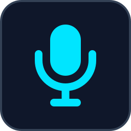
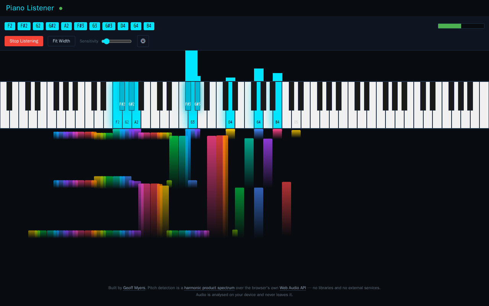

<p align="center">
  
</p>

# Piano Listener

<!-- BADGES:START -->


[](LICENSE.md)
[](CONTRIBUTING.md)
<!-- BADGES:END -->

## Table of Contents

- [Description](#description)
- [Screenshots](#screenshots)
- [Features](#features)
- [Requirements](#requirements)
- [Installation](#installation)
- [Usage](#usage)
- [Detection tests](#detection-tests)
- [Known limitations](#known-limitations)
- [Deployment](#deployment)
- [Architecture](#architecture)
- [Credits](#credits)
- [Contributing](#contributing)
- [License](#license)

## Description

Piano Listener listens through your device's microphone while you play and
shows which piano keys it thinks are sounding: on an 88-key keyboard, in a
spectrum above the keys, and in a piano roll that scrolls as you play.

It is a single web page with no libraries and no build step. The audio is
analysed in the browser with the Web Audio API and never leaves the device. A
Node.js test suite synthesises piano audio and scores the detector against it.
It runs live at [piano-listener.geoffmyers.com](https://piano-listener.geoffmyers.com).

**Accuracy is still poor.** On the test suite, the detector finds every note
that is played but also reports many that are not — see
[Detection tests](#detection-tests).

## Screenshots

<p align="center">
  
</p>

<p align="center"><em>Listening to C, F and G major chords. The "microphone" here is a recording made by the test suite's piano synthesiser, played into headless Chromium, so the extra lit keys are the detector's real false positives.</em></p>

## Features

- **All 88 keys**, A0 to C8, highlighted as they are detected, with the note
  names of everything currently sounding listed above the keyboard.
- **Spectrum** of per-key detection strength, drawn above the keys it belongs to.
- **Piano roll** that records what was detected, scrolling in time.
- **Level meter** for the microphone input.
- **Zoom:** fit the whole keyboard to the window's width, or fit the key height
  to the window and scroll sideways. The three views scroll together, follow the
  active notes, and the choice is remembered.
- **Controls:** Sensitivity, and under ⚙ a Noise Gate and a Hold Time (the
  shortest time a note stays lit once detected, 50–300 ms).
- **Private:** no network requests while listening, and nothing is recorded.

## Requirements

- A current browser with the Web Audio API and microphone access
  (`getUserMedia`), on a page served from `localhost` or over **HTTPS**.
- A microphone that can hear the piano.
- To serve it locally: any static file server, for example Python 3.
- To run the detection tests: **Node.js 18** or later and npm.
- To deploy it as the author does: a Cloudflare account and
  [Wrangler](https://developers.cloudflare.com/workers/wrangler/) 4.

## Installation

```bash
git clone https://github.com/geoffmyers/piano-listener.git
cd piano-listener
python3 -m http.server 8000
```

Then open <http://localhost:8000>. The page loads `dsp.js` as an ES module, and
browsers refuse module scripts from `file://`, so it needs a server.

## Usage

1. Press **Start Listening** and allow microphone access.
2. Play. Detected keys light up, and the piano roll fills in below.
3. If quiet notes are missed, raise **Sensitivity**. If notes appear that you
   did not play, lower it, or open ⚙ and raise **Noise Gate**.
4. **Fit Width** / **Fit Height** switches the keyboard zoom.
5. Press **Stop Listening** to release the microphone.

## Detection tests

`tests/` checks the detector without a microphone. It synthesises piano-like
audio from lists of notes (a sine wave plus four harmonics with a decaying
envelope), computes the same windowed FFT in dB that the browser's
`AnalyserNode` produces, runs it through `dsp.js`, and compares what was
detected with what was played.

```bash
cd tests
npm install
npm test          # score every scenario with the current defaults
npm run sweep     # grid-search the detector's parameters (7,500 combinations)
```

There are seven scenarios: every key alone, chords, fast passages, loud and soft
notes, the low register, the high register, and wide intervals. A scenario
passes at F1 ≥ 0.8.

With the current defaults, which are the best combination the sweep found,
every scenario fails or warns:

| Scenario | F1 | Precision | Recall |
|---|---|---|---|
| Single Notes | 0.101 | 0.053 | 1.000 |
| Chords | 0.216 | 0.121 | 1.000 |
| Fast Passages | 0.581 | 0.410 | 1.000 |
| Velocity Variations | 0.079 | 0.041 | 1.000 |
| Low Register | 0.079 | 0.041 | 1.000 |
| High Register | 0.218 | 0.123 | 1.000 |
| Wide Intervals | 0.105 | 0.056 | 1.000 |
| **All** | **0.139** | **0.075** | **1.000** |

So it misses nothing, but about 12 of every 13 notes it reports were not
played. Improving precision is the most useful contribution this project could
get.

## Known limitations

- **Precision**, as above.
- **No offline mode.** The page builds a service worker from a `blob:` URL, but
  browsers only register service workers served over HTTP(S), so the
  registration fails silently and the page needs a connection.
- The synthetic test piano is much simpler than a real one, so the scores are a
  guide, not a measurement of real-world accuracy.

## Deployment

The site is deployed as a [Cloudflare Worker with static
assets](https://developers.cloudflare.com/workers/static-assets/). The
repository root is the asset directory:

- `wrangler.toml` names the Worker and its custom domain. Both are the author's:
  change `name`, `account_id` and `routes` before deploying your own copy.
- `_headers` sets the Content-Security-Policy and other security headers.
- `.assetsignore` keeps `tests/`, `package.json` and the repository docs from
  being served.

```bash
npx wrangler@4 deploy
```

## Architecture

The microphone feeds an `AnalyserNode` (FFT size 8192). Each frame, `dsp.js`
turns the spectrum into a strength for each of the 88 keys with a harmonic
product spectrum, then decides which keys are on against an adaptive noise
floor with hysteresis and a hold time. `index.html` draws the result.

| Path | Role |
|---|---|
| `index.html` | Page, styles, audio setup, keyboard, spectrum and piano-roll rendering |
| `dsp.js` | Detection, shared by the page and the tests (ES module) |
| `tests/` | Synthesiser, FFT, scenarios, scoring and parameter sweep (Node.js) |
| `_headers`, `wrangler.toml`, `.assetsignore` | Cloudflare deployment |
| `docs/` | README icon and screenshot |

See [ARCHITECTURE.md](ARCHITECTURE.md) for the detection pipeline in detail.

## Credits

- Pitch detection uses the
  [harmonic product spectrum](https://en.wikipedia.org/wiki/Harmonic_product_spectrum)
  method, on the browser's
  [Web Audio API](https://developer.mozilla.org/en-US/docs/Web/API/Web_Audio_API).
- The tests use [fft.js](https://github.com/indutny/fft.js) by Fedor Indutny
  (MIT).
- The README icon is the [Font Awesome](https://fontawesome.com/) `microphone`
  glyph, as shown for this app on [geoffmyers.com](https://www.geoffmyers.com),
  used under [CC BY 4.0](https://creativecommons.org/licenses/by/4.0/).

Written by Geoff Myers ([geoffmyers.com](https://www.geoffmyers.com)).

## Contributing

Bug reports and pull requests are welcome. See [CONTRIBUTING.md](CONTRIBUTING.md)
for setup, checks and how this repository is published.

## License

This program is free software: you can redistribute it and/or modify it under
the terms of the GNU General Public License as published by the Free Software
Foundation, either version 3 of the License, or (at your option) any later
version.

This program is distributed in the hope that it will be useful, but WITHOUT ANY
WARRANTY; without even the implied warranty of MERCHANTABILITY or FITNESS FOR A
PARTICULAR PURPOSE. See [LICENSE.md](LICENSE.md) for the full text of the GNU
General Public License.

SPDX-License-Identifier: `GPL-3.0-or-later`
